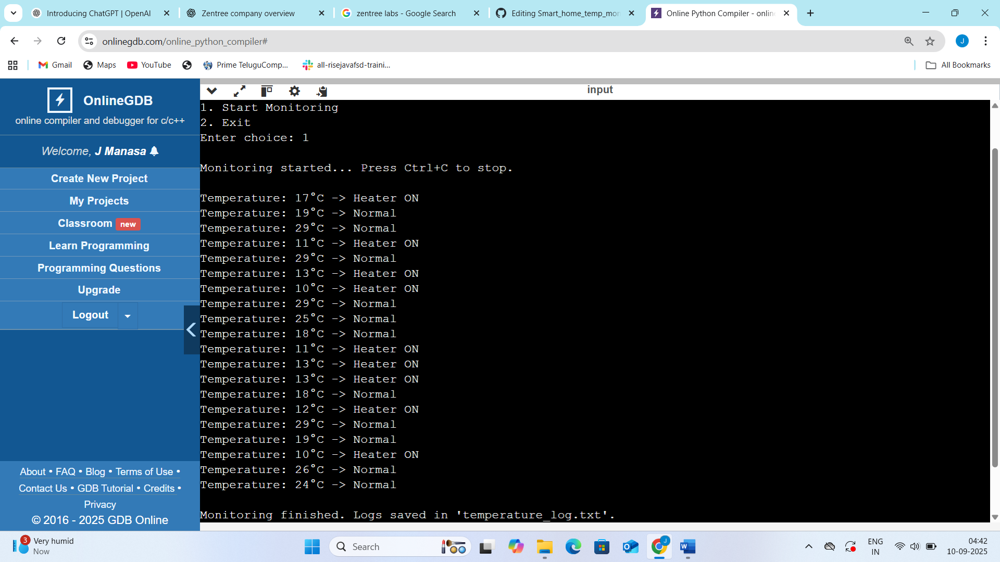

# 📸 Program Output

## 🖥️ Sample Output (Text)
====================================

Smart Home Temperature Monitor

====================================

Start Monitoring

Exit
Enter choice: 1

Monitoring started... Press Ctrl+C to stop.

Temperature: 17°C -> Heater ON
Temperature: 19°C -> Normal
Temperature: 29°C -> Normal
Temperature: 11°C -> Heater ON
Temperature: 23°C -> Normal
Temperature: 13°C -> Heater ON
Temperature: 10°C -> Heater ON
Temperature: 29°C -> Normal
Temperature: 25°C -> Normal
Temperature: 18°C -> Normal
Temperature: 12°C -> Heater ON
Temperature: 13°C -> Heater ON
Temperature: 13°C -> Heater ON
Temperature: 18°C -> Normal
Temperature: 12°C -> Heater ON
Temperature: 29°C -> Normal
Temperature: 10°C -> Heater ON
Temperature: 26°C -> Normal
Temperature: 24°C -> Normal

Monitoring finished. Logs saved in 'temperature_log.txt'.

## 📸 Sample Output (Screenshot)
Here’s an actual run of the program on **OnlineGDB**:

---

